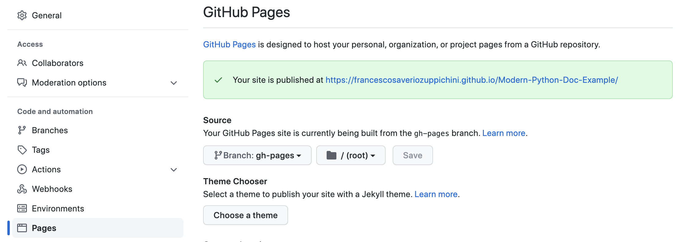
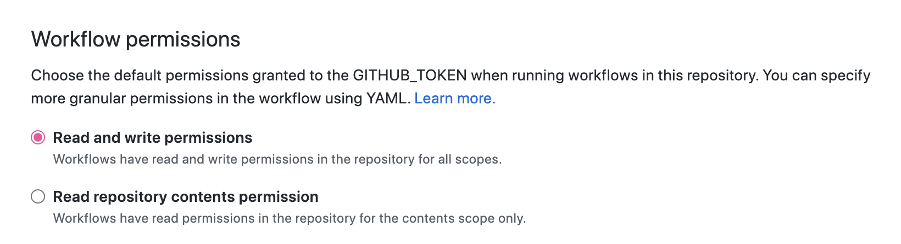

## GitHub Action

In order to automatically push your doc on github pages you need to create a new branch called `gh-pages`

```bash
git checkout -b gh-pages
git push --set-upstream origin gh-pages
```

### Github Pages Settings
Then head over the **Settings** in your repo and select the right branch and folder under the **pages** section. As shown below:



### Action permission

Then we need to make sure our actions can write in the repo, go on **Settings/Actions/General** and under **Workflow permissions** select **Read and write permissions**.




### Action

The action will be triggered on push to `main`. You can read more about action customization in the [official guide](https://docs.github.com/en/actions/learn-github-actions/finding-and-customizing-actions). The action uses the amazing premade [`github-pages-deploy-action`](https://github.com/JamesIves/github-pages-deploy-action) by [JamesIves](https://github.com/JamesIves). 

Below the code for reference.

```yaml
name: Doc WorkFlow

on:
  push:
    branches:
      - main

jobs:
  build:
    runs-on: ubuntu-latest
    strategy:
      matrix:
        python-version: [3.9]
    steps:
    - name: Checkout 🛎️
      uses: actions/checkout@v3
      with:
        ref: ${{ github.head_ref }}
        
    - name: Set up Python ${{ matrix.python-version }}
      uses: actions/setup-python@v2
      with:
        python-version: ${{ matrix.python-version }}

    - name: Install dependencies 
      run: |
        python -m pip install --upgrade pip
        pip install -r requirements.txt

    - name: Build doc 🔨
      run: |
        mkdocs build

    - name: Deploy 🚀
      uses: JamesIves/github-pages-deploy-action@v4.3.3
      with:
        BRANCH: gh-pages # The branch the action should deploy to.
        FOLDER: site # The folder the action should deploy.
```